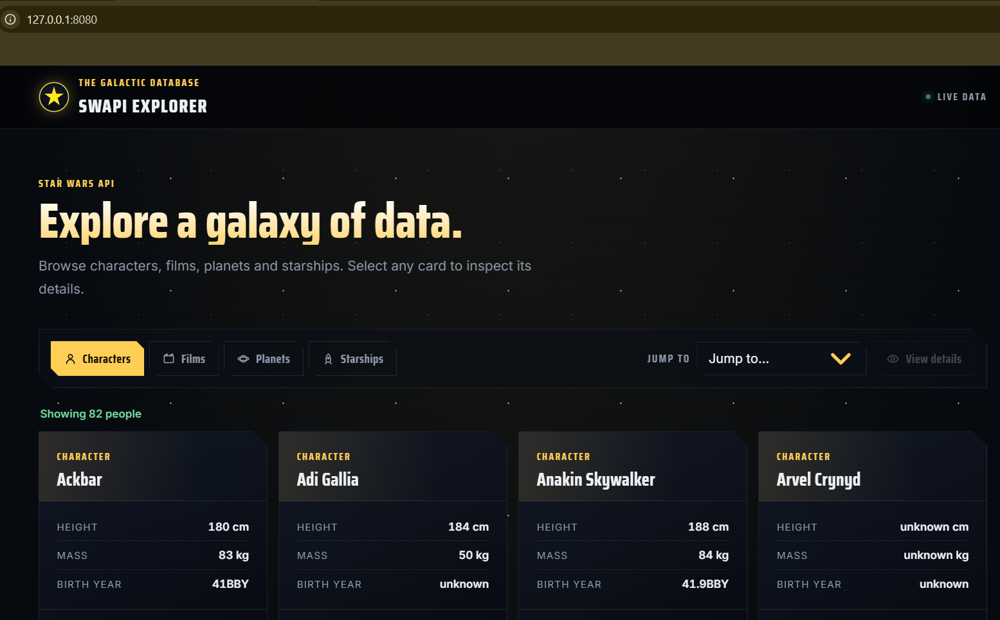

# SWAPI Explorer

A small vanilla JavaScript application for exploring data from the [SWAPI](https://swapi.info).

Browse **Characters, Films, Planets and Starships**, see the API results as cards, and click any card to open a detailed record.

## Preview



## Demo

[View SWAPI Explorer](https://paddymacmac.github.io/swapi-explorer/)

## Features

* Browse Characters, Films, Planets, and Starships
* Responsive card-based layout
* "Jump to..." dropdown for quickly finding an entity
* Alphabetically sorted entity selection
* Detailed information displayed in a modal
* Loading and error states
* Responsive design for desktop and mobile
* Hand-written modal behaviour without requiring Bootstrap's JavaScript bundle
* Automated tests covering the application's JavaScript modules
* **99% statement/line coverage and 100% function coverage**

## Technologies

* JavaScript (ES modules)
* HTML5
* CSS3
* Bootstrap 5
* Node.js
* Vitest
* jsdom
* SWAPI


## Getting started

### Requirements

- Node.js 18+
- A modern browser

### Install

```bash
npm install
```

### Start

```bash
npm start
```

The project uses a small Node standard-library server, so `npm start` does not download a separate HTTP server package.

Open:

```text
http://127.0.0.1:8080
```

To use another port on Windows PowerShell:

```powershell
$env:PORT=8081; npm start
```

The application must be served over HTTP because browser ES modules are restricted when loaded directly with `file://`.

## Testing

Run the complete test suite:

```bash
npm test
```

Watch tests during development:

```bash
npm run test:watch
```

Generate coverage:

```bash
npm run coverage
```

Tests use **Vitest** and **jsdom**. The suite covers the domain rules, API boundary, application use cases, rendering, modal behaviour and browser event wiring.

Importantly, the application test verifies the real UI flow: mocked SWAPI data is loaded, cards are rendered into `#results`, and clicking a card opens the details modal with the selected entity.

## Why this design?

The project deliberately uses **plain functional JavaScript** rather than classes or inheritance. The goal is to keep a small application easy to understand while still demonstrating useful architectural boundaries.

```text
src/js/
├── domain/
│   └── resources.js          # Resource definitions and pure domain rules
├── application/
│   └── explorer.js           # Resource loading and selection use cases
├── infrastructure/
│   └── swapiClient.js        # SWAPI HTTP boundary
├── ui/
│   ├── render.js             # DOM rendering only
│   └── modal.js              # Modal behaviour only
└── app.js                    # Composition root and browser events
```

### Responsibilities

- **Domain** — knows what resources exist, how entities are named and sorted, and which fields are displayed.
- **Application** — coordinates use cases without knowing about the DOM or `fetch`.
- **Infrastructure** — knows how to call SWAPI. The client accepts a fetch function, making it easy to test without the network.
- **UI** — renders data and controls the modal. It does not fetch data or own application state.
- **`app.js`** — wires the pieces together and translates browser events into use-case calls.

This is DDD-inspired rather than a full enterprise DDD implementation. A small browser application does not need repositories, aggregates and elaborate domain classes just to satisfy a pattern.

## Clean code choices

The refactor intentionally favours:

- descriptive names such as `createExplorer`, `getSelectedEntity` and `renderResults`;
- small functions with one clear responsibility;
- dependency injection at the infrastructure boundary;
- configuration instead of repeated resource-specific rendering code;
- immutable-style operations such as sorting a copy of API results;
- DOM APIs and `textContent` for external values rather than building HTML strings from API data;
- one-way flow from API → application → UI;
- no class hierarchy or inheritance where it would add complexity without value.

## User experience

- Star Wars-inspired dark interface with restrained gold accents.
- Responsive cards for all four resource types.
- Every card is clickable and opens its details modal.
- Cards are also keyboard accessible with **Enter** or **Space**.
- The **Jump to** control selects a record and enables **View details**.
- Modal closes with the close buttons, backdrop or **Escape**.
- Loading and API error states are displayed to the user.

## Project structure

```text
.
├── index.html
├── package.json
├── package-lock.json
├── vitest.config.js
├── scripts/
│   └── server.js
├── public/
│   └── images/
├── src/
│   ├── css/
│   │   └── style.css
│   └── js/
│       ├── domain/
│       │   └── resources.js
│       ├── application/
│       │   └── explorer.js
│       ├── infrastructure/
│       │   └── swapiClient.js
│       ├── ui/
│       │   ├── render.js
│       │   └── modal.js
│       └── app.js
└── test/
    ├── domain.test.js
    ├── swapiClient.test.js
    ├── application.test.js
    ├── render.test.js
    ├── modal.test.js
    └── app.test.js
```

## Architecture trade-offs

### Why functional JavaScript?

The application has little need for mutable objects with identity or inheritance. Functions and closures keep the code shorter and make individual behaviours straightforward to test.

### Why not create a repository?

The only persistence-like operation is a GET request to SWAPI. Adding a repository abstraction would add another layer without solving a current problem. The HTTP client is already isolated behind a small dependency boundary.

### Why keep resource definitions together?

Characters, films, planets and starships have different fields, but their behaviour is structurally the same. A small configuration object avoids four almost-identical renderer implementations while keeping the differences explicit.

### Why is `app.js` still relatively small?

It acts as the composition root: browser events are connected to application use cases and UI functions there. Business and rendering logic are kept outside it so it does not become a large controller.

## What the project demonstrates

- REST API integration with `fetch`
- ES modules
- Functional programming techniques
- Separation of concerns
- Dependency injection
- DDD-inspired boundaries
- Clean code and SOLID principles applied pragmatically
- DOM manipulation and event delegation
- Accessibility and keyboard interaction
- Error/loading states
- Unit and DOM integration testing
- Responsive UI design

## API

Data is provided by [SWAPI](https://swapi.info). The application currently uses:

- `/api/people`
- `/api/films`
- `/api/planets`
- `/api/starships`
